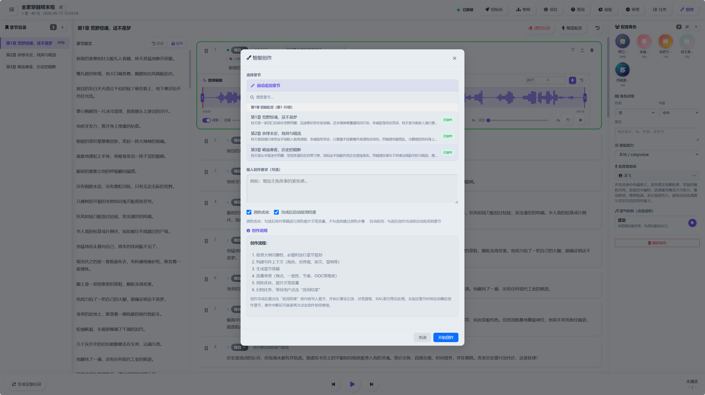

# CosyStudio

> 一站式本地 AI 网文创作与有声书生成平台 —— 从项目初始化、卷纲规划、章节智能创作到整章配音，全流程本地化运行。


---

## 系统预览

剧本编辑器是网文创作的核心工作台，集成项目初始化、卷纲规划、智能创作、质量审查全流程，实时推送创作进度：



---

## 核心功能

### 智能创作全流程流水线

完整的 AI 辅助网文创作系统，覆盖从项目初始化到章节成稿、再到创作结果应用的全流程。采用多执行器流水线架构，每个执行器负责一个独立步骤，由编排器统一调度，支持中断恢复与实时进度推送。

#### 上下文构建与按需分析（ContextBuilder / ContextAnalyzer）

在每一个创作/审查节点调用 LLM 生成前，先由轻量级 LLM 分析确定该步骤**需要哪些上下文条目**（角色/前文/伏笔/世界观/力量体系/金手指/RAG 查询/一致性要点），再从数据库精准加载完整数据、执行 RAG 语义检索，组装最终上下文供执行器使用——替代"全量加载 + 硬编码裁剪"策略，降低 token 成本，并保证每个节点只看到自己必要的设定。

每个节点有独立的**字段白名单**与**一致性维度清单**（如草稿生成：角色行为与性格一致、角色状态连续、物品清单约束、前文自然承接、信息暴露边界、能力行为边界），由分析器生成 `consistency_notes` 注入创作节点，从机制上约束 LLM 的输出一致性。

#### 写作流水线（核心创作路径）

```
上下文构建 → 剧情生成 → 剧情审查 → 草稿生成 → 草稿审查 → 草稿润色 → 应用结果
（每个节点前：ContextAnalyzer 按需组装上下文）
```

| 步骤    | 执行器                  | 说明                                                                              |
| ----- | -------------------- | ------------------------------------------------------------------------------- |
| 上下文构建 | ContextBuilder       | 组装核心设定、角色卡片、金手指、力量体系、世界观、卷章规划、前文回顾、RAG 语义检索结果、反套路规则，生成上下文清单供 ContextAnalyzer 选择 |
| 剧情生成  | ChapterPlotGenerator | 基于章节规划和上下文，生成场景级详细剧情列表                                                          |
| 剧情审查  | ChapterPlotReviewer  | 多维度质量审查（规划覆盖/因果逻辑/冲突张力），低于 7 分自动触发修正，最多 2 轮                                     |
| 草稿生成  | DraftGenerator       | 基于剧情列表创作白描草稿（默认约成品字数的 40%），注入 RAG 检索结果与一致性约束                                    |
| 草稿审查  | DraftReviewer        | 5 维度审查（爽点呈现/设定一致/节奏控制/叙事连贯/追读力），最多 3 次修改迭代                                      |
| 草稿润色  | DraftPolisher        | 将审查后的草稿润色为最终小说文本（默认成品区间）                                                        |

**写作模式**：

| 模式              | 步骤              | 适用     |
| --------------- | --------------- | ------ |
| `write`         | 完整链路 + 设定记录     | 标准创作   |
| `write_fast`    | 完整链路（不含设定记录）    | 快速出稿   |
| `write_minimal` | 剧情→草稿→润色（无审查迭代） | 最低成本草稿 |

**字数参数化**：单章成品目标字数可配置（默认 4000 字），系统自动推导各节点区间（润色 ±20%、白描 ×0.4）并联动 `max_tokens`。

#### 项目初始化（7 步引导式创建）

分步交互式创建项目，每步均支持 AI 辅助生成：

1. **基础信息** — 书名、题材、目标字数
2. **主角设定** — 性格、背景、说话风格
3. **金手指设定** — 类型、风格、代价
4. **世界观设定** — 地理、社会、资源、信仰
5. **创意约束包** — AI 生成 3 个反套路规则方案供选择
6. **确认执行** — 将所有设定写入数据库

另有**深度初始化**批量构建角色卡（含身份/性格/能力/OOC 警告等字段）与项目基线数据。

#### 卷纲规划

补齐设定基线 → 选择目标卷 → 生成节拍表 → 生成时间线 → 生成骨架 → 批量生成章纲 → 验证保存，形成可落地的章节级大纲。

#### 应用结果（创作完成后的后处理）

创作内容保存为章节后自动执行，也支持单独重跑：

| 步骤                 | 说明                                                                                              |
| ------------------ | ----------------------------------------------------------------------------------------------- |
| 章节保存               | 内容过滤、标题提取、写入章节文件                                                                                |
| 事实记录（FactRecorder） | **一次 LLM 调用结构化提取六块**：物品变化（获得/失去扣减，追加流水）、角色更新（关系/身份揭露/成长/能力）、伏笔（核心/支线/装饰三级）、爽点（15 种类型）、结尾钩子、角色状态 |
| 新角色建卡              | 正文出现的新角色自动建角色卡并写入关系                                                                             |
| 伏笔回收检查             | 对照已埋伏笔自动判定回收/更新 urgency                                                                         |
| 角色卡 RAG 增量重建       | 物品/身份/改名涉及的角色卡增量重建向量索引                                                                          |
| RAG 索引构建           | 新章节内容入向量库，供后续章节语义检索                                                                             |

#### 质量保障

- **剧情审查**：规划覆盖率、因果逻辑、冲突张力，2 轮自动修正
- **草稿审查**：爽点呈现、设定一致性、节奏控制、叙事连贯、追读力，3 轮迭代修改
- **一致性约束**：ContextAnalyzer 按节点生成 `consistency_notes`（角色状态连续/物品清单约束/知识边界/时间线等），注入每个创作节点
- **角色状态连续**：上一章角色状态自动注入本章创作，防止角色"失忆"/状态漂移
- **伏笔追踪**：自动提取并管理伏笔，支持 urgency 状态更新与回收判定
- **爽点追踪**：15 种爽点类型自动识别与记录

#### 诊断与可观测性

| 能力                | 说明                                                                                        |
| ----------------- | ----------------------------------------------------------------------------------------- |
| **prompt_diag**   | 创作提示词诊断专用脚本：指定流水线某一节点真实调用，其余节点用基准快照回放；默认只保留上下文分析真实调用，实现低成本、可对照的单点 prompt 调优               |
| **pipeline_diag** | 全流程诊断工具：每次运行把每一步执行过程（每次 LLM 调用的完整 prompt/输出、每个执行器耗时、每次 DB 写入）记录到独立文件夹，供离线分析可优化节点          |
| **LLM 调用日志**      | 所有 LLM 调用经统一入口写入 `app_llm_logs.db`，含 executor/prompt_name/完整输入输出/解析结果/tokens/延迟/报错，出错也能追溯 |

### RAG 模块

基于 **Qwen3-Embedding-0.6B** 的本地语义向量检索系统，用于在创作时按需召回前文与设定，保持长篇小说跨章节一致性。

#### 索引结构

向量库按项目隔离，索引块带类型标记（`chunk_type`），支持多类内容混合检索：

| 索引块类型                         | 内容                      |
| ----------------------------- | ----------------------- |
| `setting`                     | 项目设定、世界观、力量体系等基础设定      |
| `character`                   | 角色卡（身份/性格/能力/物品等）       |
| `chapter` / `chapter_summary` | 已写章节全文 / 章节摘要           |
| `chapter_paragraph`           | 章节段落级索引（检索命中后扩展前后段落上下文） |
| `foreshadow`                  | 伏笔（支持按伏笔状态召回）           |

#### 检索流程

```
ContextAnalyzer 生成针对性查询（含实体与限定、禁止复制原文）
   → Qwen3-Embedding 编码（查询向量）
   → 向量库余弦相似度检索 + chunk_type 过滤
   → 分级相似度阈值过滤（按索引块类型差异化阈值，按中文小说语料实测校准）
   → 检索结果注入上下文，供创作节点消费
```

- **按需检索**：查询由 LLM 针对当前节点生成（如"主角上次与张三见面的场景"），而非固定规则拼接，保证召回内容与当前创作目标相关
- **分级阈值**：不同索引块类型采用不同相似度阈值（高质量结构化摘要要求更高阈值，设定类语义空间宽泛可放宽），减少噪声注入
- **段落上下文扩展**：命中段落级索引时自动扩展前后段落，保证注入内容语义完整
- **写作时注入**：草稿生成等创作节点将 RAG 检索结果作为上下文片段注入，约束前文承接与设定一致

#### 索引生命周期

- **增量构建**：每章创作完成后，新章节内容自动入向量库
- **角色卡增量重建**：物品/身份/改名涉及的角色卡，自动重建对应向量索引，避免陈旧设定
- **删除与重建**：支持按章节/角色/类型定向删除与整项目重建，保证索引与正文一致

### 有声书生成

基于 CosyVoice3 的语音合成系统，支持从单句配音到整章有声书生成的完整链路。

#### 整章配音

```
章节台词列表 → 逐句语音合成 → 音频拼接 → 完整 WAV + SRT 字幕 → 打包下载
```

- **整章合成**：自动遍历章节所有台词，逐句合成后拼接为完整音频文件，同时生成 SRT 字幕文稿
- **整章导出**：合成并打包为 ZIP（audio.wav + subtitles.srt）直接下载
- **配音历史**：保存每次合成的完整记录，支持回听和重新下载

#### 单句配音

- **流式合成**：NDJSON 流式输出 PCM 音频，边合成边播放
- **台词配音**：根据台词自动获取文本、角色、语气参数，一键合成
- **参数控制**：支持音量调节、变调、淡入淡出、区间裁剪

#### 语音与缓存

- **多音色**：CosyVoice3-0.5B 本地推理，支持自定义说话人（角色语气注册为独立 speaker）与 instruct 模式
- **音频缓存**：相同文本 + 角色 + 语气的合成结果自动缓存，重复台词无需重新合成，大幅提升整章配音效率

---

## 其他功能

| 模块         | 说明                                   |
| ---------- | ------------------------------------ |
| **智能对话**   | 基于 Qwen 的流式文本对话，支持多轮上下文              |
| **AI 智能体** | 创建个性化智能体，自定义人设、音色与行为参数               |
| **语音通话**   | 语音输入 → ASR 转写 → LLM 回复 → TTS 语音输出全链路 |
| **文生图**    | 基于 DreamLite 的本地图像生成                 |
| **语音识别**   | 基于 Whisper 的语音转文字，支持繁简转换             |
| **电子书管理**  | TXT/EPUB 上传、自动章节拆分、在线阅读              |
| **模型管理**   | 统一管理本地模型与云端 API，按需加载/卸载              |

**支持的 AI 平台**：本地模型（文本/TTS/文生图/Embedding）、阿里云 DashScope、智谱 AI、火山引擎（豆包）、OpenRouter、DeepSeek / Google Gemini / 百度文心

---

## 快速开始

### 环境要求

- Python >= 3.10
- NVIDIA GPU + CUDA（本地模型推理需要）
- conda 环境（推荐）

### 安装

```bash
git clone <repo-url>
cd CosyStudio

conda create -n cosy_chat python=3.10
conda activate cosy_chat
pip install -r backend/requirements.txt
```

### 配置模型

编辑 `config/system_config.json`，配置本地模型路径（项目根相对路径）：

```json
{
  "models": {
    "cosyvoice": {
      "model_path": "pretrained_models/cosyvoice/CosyVoice3-0.5B-2512"
    },
    "qwen": {
      "model_path": "pretrained_models/qwen/Qwen_Qwen3.5-4B"
    },
    "dreamlite": {
      "model_path": "pretrained_models/dreamlite/DreamLite-mobile-4bit"
    },
    "qwen_embedding": {
      "model_path": "pretrained_models/qwen_embedding/Qwen_Qwen3-Embedding-0.6B"
    }
  }
}
```

如需使用云端 API，在同一配置文件中填写对应平台的 `api_key`。

### 启动服务

```bash
cd backend
python -m uvicorn main:app --port 8080
```

服务默认运行在 `http://localhost:8080`，可在 `config/system_config.json` 的 `system.port` 修改端口。

### 使用流程

1. 打开浏览器访问 `http://localhost:8080/script_editor.html` 进入剧本编辑器
2. 创建新项目，按 7 步引导完成初始化（每步可 AI 辅助生成）
3. 进行卷纲规划，生成章节大纲
4. 选择写作模式，开始 AI 创作，实时查看进度
5. 创作完成后自动应用结果（事实记录/伏笔/爽点/RAG 索引），使用整章配音功能生成有声书

---

## 项目结构

```
CosyStudio/
├── backend/                     # 后端服务
│   ├── webnovel/                # 网文创作模块
│   │   ├── pipeline/            #   写作流水线（编排器/上下文分析器/各节点执行器）
│   │   ├── prompts/             #   LLM Prompt 模板
│   │   ├── repositories/        #   网文数据访问层（角色状态/角色卡/伏笔等）
│   │   └── services/            #   网文业务服务（创作/应用结果/后处理）
│   ├── services/vector_store/   # RAG 向量检索（SQLite 向量库 + RAGService）
│   ├── models/                  # 模型封装（CosyVoice3 / Qwen / DreamLite / Embedding）
│   ├── tools/                   # 诊断工具（prompt_diag / pipeline_diag）
│   └── api/                     # 服务路由
├── frontend/                    # 前端静态资源（剧本编辑器/阅读器/主页）
├── config/                      # 系统配置
├── pretrained_models/           # 本地预训练模型
├── media/                       # 媒体资源
└── data/                        # 运行时数据（缓存/日志/输出/诊断产物）
```

---

## 技术栈

| 层         | 技术                                                 |
| --------- | -------------------------------------------------- |
| **后端框架**  | FastAPI + Uvicorn，SQLite 数据持久化                     |
| **AI 推理** | PyTorch + CUDA，Transformers                        |
| **文本模型**  | Qwen3.5（生成）、Qwen3-Embedding（检索）、Qwen3-Reranker（重排） |
| **语音合成**  | CosyVoice3-0.5B，多音色、流式输出、音频缓存                      |
| **语音识别**  | OpenAI Whisper                                     |
| **图像生成**  | DreamLite-mobile-4bit（Diffusers）                   |
| **前端**    | 原生 HTML/JS，Bootstrap 5，WebSocket 实时通信              |

---

## 许可证

MIT License
